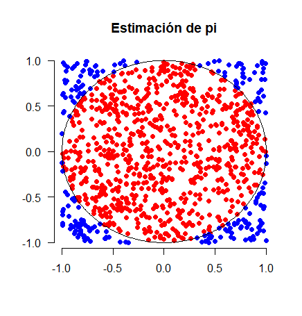

# Estimación de Pi por el método de Montecarlo

## Introducción

Intento de estimar el valor de $\pi$ mediante el método de Montecarlo basándonos en un círculo y su cuadrado circunscrito asociado.

Se hacen distintos lanzamientos aleatorios obteniendo puntos del cuadrado y se ve si están dentro del círculo o no. Como el área del círculo es $\pi r^2$ y el del cuadrado circunscrito es $4 r^2$, tomando puntos aleatorios del cuadrado la probabilidad de caer en el círculo será de $\frac{\pi r^2}{4 r^2}= \frac{\pi}{4}$. Por tanto podemos aproximar Pi de la forma:

$$\pi \simeq  4 \cdot \frac{aciertos}{tiradas},$$

siendo acierto el caer dentro del círculo.



En la figura se muestra un experimento con 1000 intentos, de los que 783 han caído dentro del círculo (puntos rojos) y 217 fuera (puntos azules). Este experimento daría la siguiente estimación de pi:

$$\pi \simeq 4 \cdot \frac{783}{1000} = 3.132$$

## Estimación

La estimación se hace gracias a un pequeño script en _python_. 

Para hacer una tirada, se calcula aleatoriamente un punto dentro del cuadrado de lado 2 (consideramos $r=1$). Centrando el cuadrado en el $(0,0)$ sería obtener unos $x$  e $y$ aleatorios entre $-1$ y 1.

Tendremos éxito si $(x,y)$ están en el círculo, es decir, si $x^2 + y^2 <= 1$.

## Código

```python
# Estimación de pi mediante el método de Montecarlo

from random import randint, uniform,random
aciertos = 0
INTENTOS = 1000000

for i in range(1, INTENTOS):
    x = uniform (-1,1)
    y = uniform(-1,1)
    if x**2 + y**2 <= 1:
        aciertos += 1
        
pi = (aciertos / INTENTOS) * 4

print(pi)
```


## Resultado

Se han obtenido los siguientes valores

|   Tiradas | Estimación de $\pi$ |
| --------: | ------------------- |
|       100 | 3,04                |
|     1.000 | 3,172               |
|    10.000 | 3,1376              |
|   100.000 | 3,14204             |
| 1.000.000 | 3,1429              |

## Nota

Los gráficos los he generado haciendo un script similar al anterior en _python_, pero en este caso en _R_.

```R
INTENTOS = 1000

x = runif(INTENTOS, min=-1, max=1)
y = runif(INTENTOS, min=-1, max=1)
z = sqrt(x^2+y^2)

aciertos = length(which(z<=1))
pi = 4 * aciertos/INTENTOS


plot(x[which(z<=1)],y[which(z<=1)], pch=16, col='red',  
     xlab="", ylab="", axes=FALSE)
points(x[which(z>1)],y[which(z>1)], pch=16, col='blue')
title(
  main = "Estimación de pi"
)

axis(1, seq(-1,1,0.5))
axis(2, seq(-1,1,0.5), las=2)

circulo_x = c(seq(-1, 1, 0.01), seq(1, -1, -0.01))
circulo_y = sqrt(1-circulo_x^2)
points(circulo_x,circulo_y,type="l")
points(circulo_x,-circulo_y,type="l")
```


